# 操作系统

《王道操作系统》学习笔记

## 一、计算机系统概论

### 1.1、操作系统基本概念、功能

**操作系统**是指控制和管理整个计算机系统的硬件和软件资源，并合理地组织调度计算机的工作和资源的分配，以提供给用户和其他软件方便的接口和环境，他是计算机系统中最基本的系统软件。

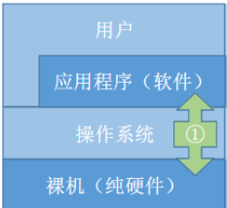

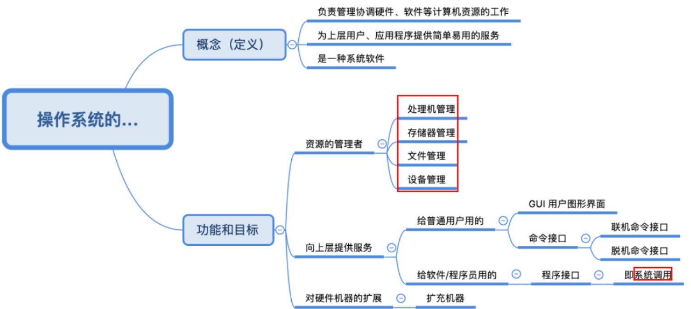

------

### 1.2、操作系统的特征

- 并发
- 共享
- 虚拟
- 异步

其中，**并发和共享**为两个最基本的特征。

---

#### 并发

**广义的并发**：指两个或多个事件在同一时间间隔内发生。这些事件宏观上是同时发生的，但微观上是交替发生的。

**操作系统的并发性**：指计算机系统中“同时”运行着多个程序，这些程序宏观上看是同时运行着的，而微观上看是交替运行的。

单核CPU同一时刻只能执行`一个`程序，各个程序只能`并发`地执行。

多核CPU同一时刻可以同时执行`多个`程序，多个程序可以`并行`地执行。

> **Q：并发与并行有什么区别**？
>
> 并发：指两个或多个事件在同一时间间隔内发生。这些事件在宏观上是同时发生的，但微观上是交替发生的。
>
> 并行：指两个或多个事件在同一时刻同时发生。

---

#### 共享

即资源共享，是指系统中的资源可供内存中`多个并发`执行的进程共同使用。

> **Q:并发与共享之间的关系？**
>
> 并发性指计算机系统中同时存在着多个运行着的程序，而共享性是指系统中的资源可供内存中多个并发执行的进程共同使用。
>
> - 资源共享是以程序并发为条件的，若系统不允许程序并发执行，则自然不存在资源共享问题。
> - 若系统不能对资源共享实施有效的管理，则必将影响到程序的并发执行，甚至根本无法并发执行。

---

#### 虚拟

是指把一个物理上的实体变为若干个逻辑上的对应物。

**物理实体**（前者）是实际存在的，而**逻辑上对应物**（后者）是用户感受到的事物。

操作系统中利用了多种虚拟技术来实现虚拟处理器、虚拟内存和虚拟外部设备等。

操作系统中的虚拟技术可归纳为：

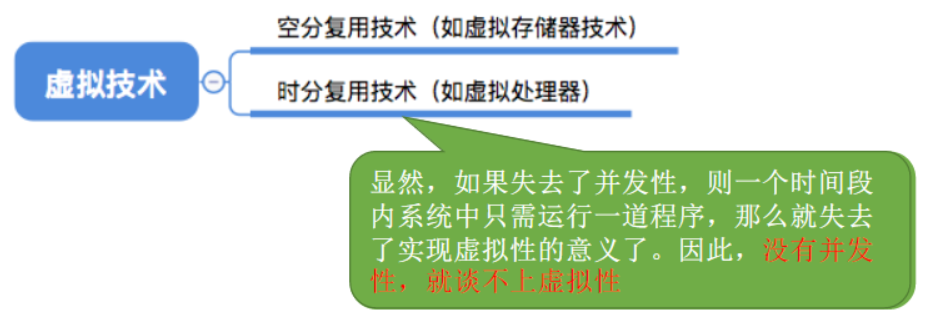

---

#### 异步

在多道程序环境下，允许多个程序并发执行，但由于资源有限，进程的执行不是一贯到底的，而是走走停停，以不可预知的速度向前推进，这就是进程的异步性。

如果失去了并发性，即系统只能串行地运行各个程序，那么每个程序的执行会一贯到底。只有系统拥有并发性，才有可能导致异步性。

------

### 1.3、操作系统的发展和分类

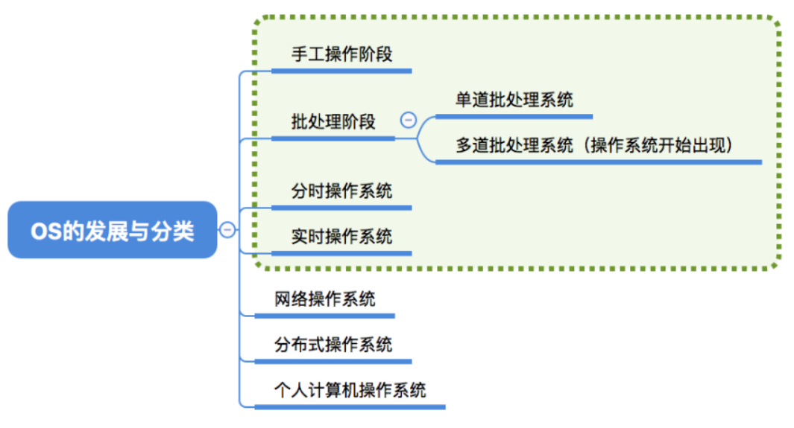

------

### 1.4、操作系统的运行机制

#### 两种程序

计算机系统中，通常CPU执行两种不同性质的程序：

- 操作系统内核程序
- 用户自编程序(应用程序)

#### 两种指令

对操作系统而言，这两种程序的作用不同，前者是后者的管理者，因此内核程序要执行一些特权指令，而应用程序处于安全考虑不能执行这些指令，只能执行一些非特权指令。

>  **注：**特权指令，是指计算机中不允许用户直接使用的指令。如I/O指令、置中断指令等指令。

#### 两种处理器状态

而在具体的实现当中，将CPU的状态划分为：**内核态**和**用户态**，

>  注：别名：内核态=核心态=管态；用户态=目态

- 处于内核态时，说明此时正在运行的是内核程序，此时可以执行`特权指令`
- 处于用户态时，说明此时正在运行的是应用程序，此时只能执行`非特权指令`

> **扩展：** 
>
> CPU中有一个寄存器叫**程序状态字寄存器**（`PSW`），其中有个二进制位，1表示“内核态”，0表示“用户态”

#### 两种转换

- **内核态-->用户态：**执行一条特权指令——修改`PSW`的标志位为“用户态”，这个动作意味着操作系统将主动让出CPU使用权。

- **用户态-->内核态：**由“中断”引发，硬件自动完成变态过程，触发中断信号意味着操作系统将强行夺回CPU的使用权。

> 但凡需要操纵系统介入的地方，都会触发中断信号。

------

### 1.5、中断与异常

#### 中断的作用

前边我们知道CPU上会运行两种程序，一种是操作系统内核程序，一种是应用程序。

在合适的情况下，操作系统内核会把CPU的使用权主动让给应用程序，**中断**是让*操作系统内核夺回CPU使用权*的**唯一途径**。

如果没有“中断”机制，那么一旦应用程序上CPU运行，CPU就会一直运行这个应用程序，那就自然不会有中断机制。

#### 中断的分类

广义的中断分为以下两种：

- 内中断
  - 与当前执行的指令**有关**， 中断信号来源于**CPU内部**
  - 分为三种：
    - 陷阱、陷入(trap)
      - 由陷入指令引发，是应 用程序故意引发的。
    - 故障(fault)
      - 由错误条件引起的，可能被内核程序修复。内核程序修复故障后会把CPU使用权还给应用程序，让它继续执行下去。如：缺页故障。
    - 终止(abort)
      - 由致命错误引起，内核程序无法修复该错误，因此一般不再将CPU 使用权还给引发终止的应用程序， 而是直接终止该应用程序。如： 整数除0、非法使用特权指令
- 外中断
  - 与当前执行的指令**无关**， 中断信号来源于**CPU外部**
  - 例如：时钟中断、I/O中断

>  注：大多数的教材、试卷中，“中断”特指狭义的中断，即外中断。而内中断一般称为“异常”

#### 中断机制的基本原理

不同的中断信号、需要用不同的中断处理程序来处理。

**检查中断信号：**

- 内中断
  - CPU在执行指令时会检查是否有异常发生。
- 外中断
  - 每个指令周期末尾，CPU都会检查是否有中断信号需要处理。

当CPU检测到中断信号后，会根据中断信号的类型去查询“中断向量表”，以此来找到相应的中断处理程序在内存中的存放位置。

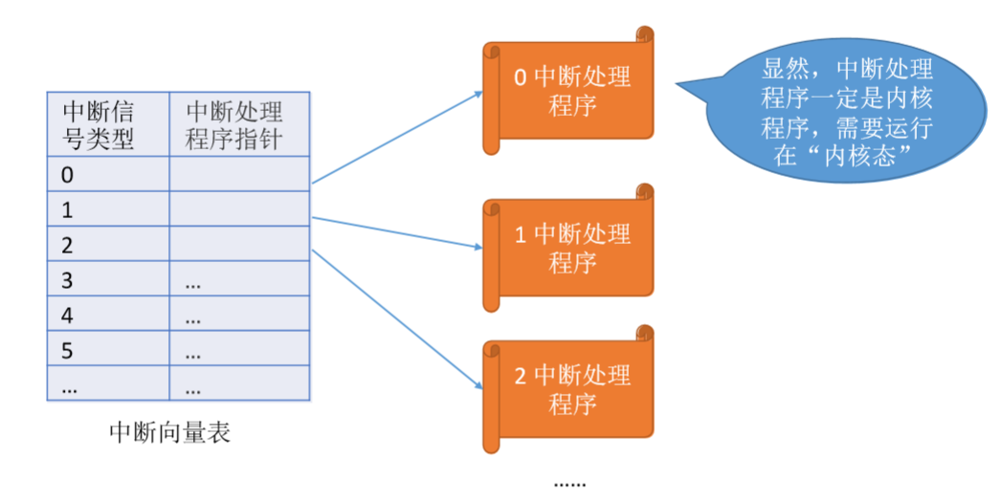

------

### 1.6、系统调用

> 前边学到：操作系统作为用户和计算机硬件之间的接口，需要向上提供一些简单易用的服务。主要包括命令接口和程序接口。其中，程序接口由一组**系统调用**组成。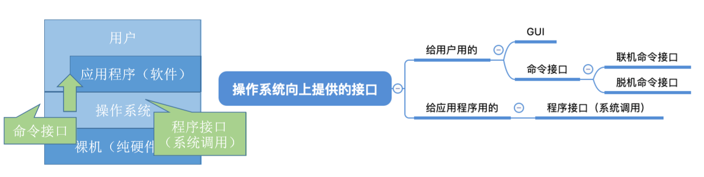

**系统调用**是操作系统提供给<u>应用程序</u>（程序员/编程人员）使用的**接口**，可以理解为一种可供应用程序调用的特殊函数，应用程序可以通过系统调用来请求获得操作系统内核的服务。

---

#### 系统调用与库函数的区别

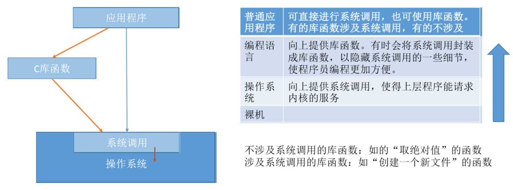

---

#### 什么功能要用到系统调用？

应用程序通过**系统调用**请求操作系统的服务。而系统中的各种共享资源都由操作系统内核统一掌管，因此凡是**与共享资源有关的操作（如存储分配、I/O操作、文件管理等），都必须通过系统调用的方式向操作系统内核提出服务请求**，由操作系统内核代为完成。

这样可以保证系统的稳定性和安全性，防止用户进行非法操作。

---

#### 系统调用的过程

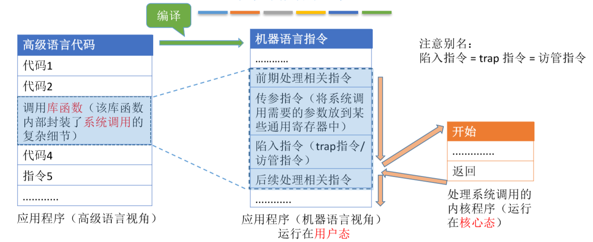

> 注：
>
> 1. 陷入指令时在**用户态**执行的，执行陷入指令之后立即引发一个内中断，使CPU进入核心态。
>
> 2. 发出系统调用请求是在用户态，而对系统调用的相应处理在核心态下进行的。

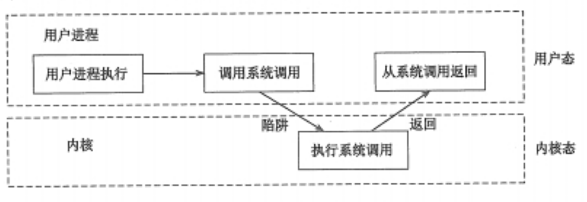

---

### 1.7、操作系统的体系结构

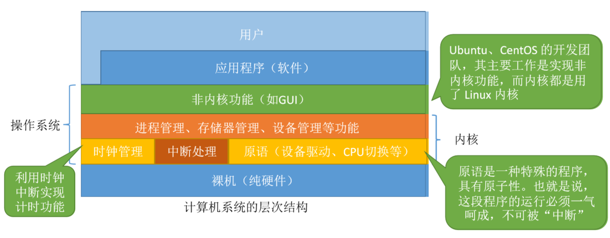

<b>大内核</b>

内核是操作系统最基本、最核心的部分。 实现操作系统内核功能的那些程序就是内核程序。

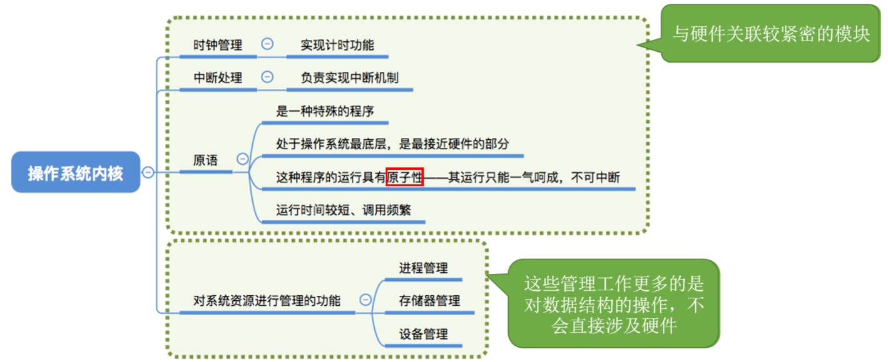

<b>操作系统内核</b>

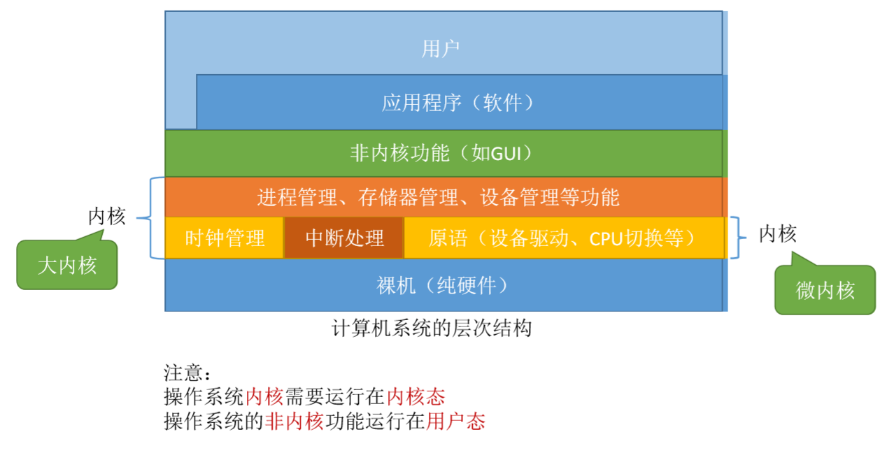

<b>小内核(微内核)</b>

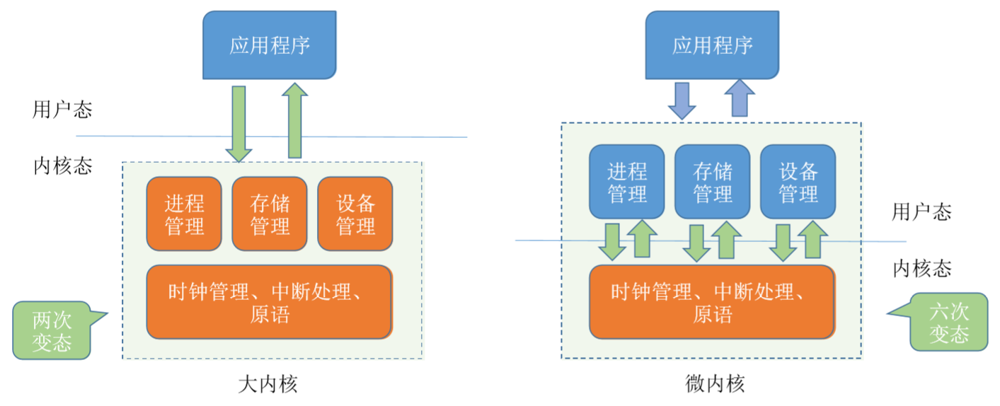

<b>大内核与微内核的“变态”</b>

注意：CPU状态转换的过程是有成本的，要消耗不少时间，频繁地变态会降低系统性能。

**总结：**

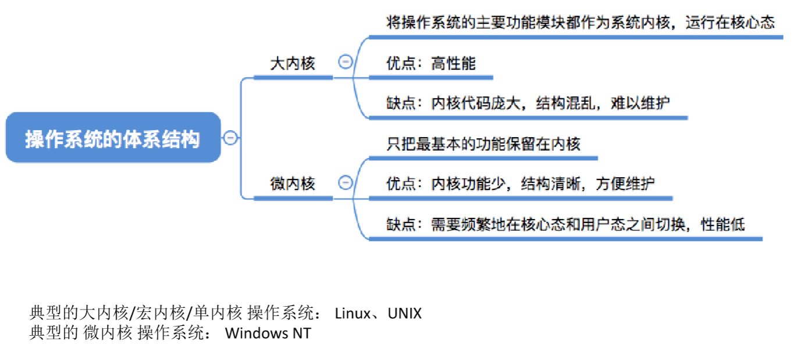

------

